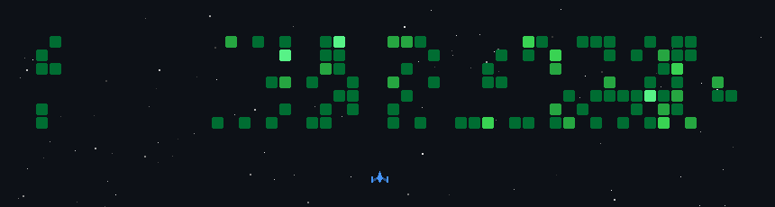
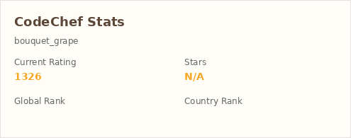

##  GitHub Activity

  

---

# 👋 Hey, I'm Hanshal Bobate

> I break problems, fix bugs, and pretend bugs were features.

🚀 Student | 🧠 Problem Solver | 🛠️ Builder  
☕ Powered by chai, deadlines, and mild chaos  

---

## 🧠 About Me

- I like **systems that think**, not apps that blink  
- Interested in **AI, safety systems, simulations, and automation**
- Currently building things where **data + logic > UI sugar**
- Learning by **breaking stuff** (responsibly… mostly)

Socho aise: agar system boring hai, toh main interested nahi hoon.

---

## ⚙️ Tech Stack

**Languages**
- Python, C, C++, Java, JavaScript

**Core Skills**
- Data Structures & Algorithms  
- Simulations & modeling  
- Git & Linux  
- Databases (SQLite, SQL basics)

**Currently Exploring**
- AI-driven behavior analysis  
- Real-time systems  
- Mobile + backend integration  

---

## 🧪 Projects Mindset

- Functionality > Fancy UI  
- Logs > Assumptions  
- Edge cases are not “rare”, they’re **inevitable**

If it works once, it’s luck.  
If it works twice, it’s suspicious.  
If it works always — now we talk.

---
## 💻 Competitive Coding Stats

### 🟦 Codeforces

### 🟨 LeetCode

### 🍛 CodeChef

---
## 📬 Reach Me

- Website: [hanshalbobate.in](https://hanshalbobate.in)
- Email: hanshalbobate2006@gmail.com
- GitHub: you're already stalking me 😄  

---

⭐ If you find my work useful, drop a star  
💀 If you find a bug, congrats — you’re now part of the project
